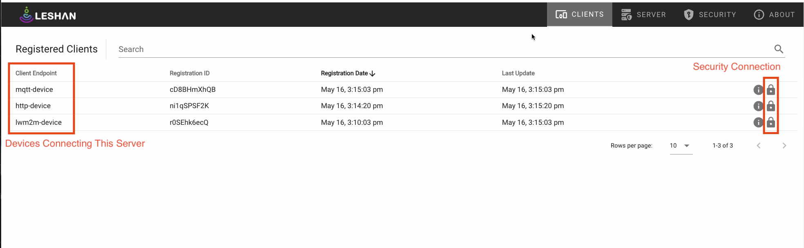
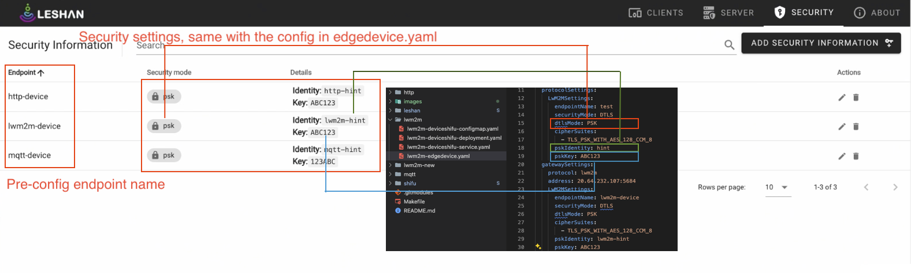
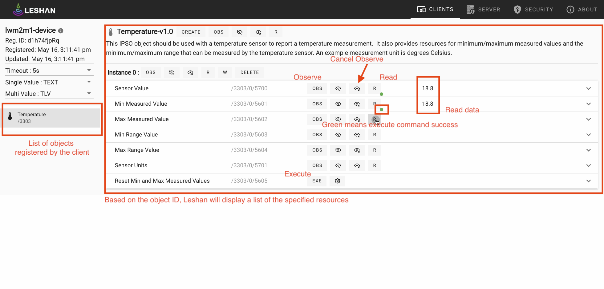

## Introduction

This demo showcases the integration of mock LwM2M protocol devices with Shifu, alongside devices using HTTP and MQTT protocols. Shifu communicates with the LeShan server via the LwM2M protocol, demonstrating seamless device management and interaction.


## Demo Result 

All devices connect to the LwM2M mock server (LeShan server).



Create a security object for each device in the LeShan server to ensure communication security.



Operate the devices in the LwM2M mock server.




## Hardware and Software Requirements

Demo tested on:
- Raspberry Pi 4B (4GB RAM) with Raspberry Pi OS (64-bit)
- K3s v1.29.4+k3s1
- Docker v26.0.0
- Go 1.22.3

## Preparation

### Clone the code repository

```bash
git clone --recurse-submodules https://github.com/Edgenesis/shifu-lwm2m-demo.git
```

### Run LeShan Mock Server

Start the LeShan mock server as LwM2M Server in Cloud.

```bash
docker run --name edgenesis/lwm2m-demo-leshan-server:nightly -d -p 5683:5683/udp -p 5684:5684/udp -p 8080:8080/tcp leshan-server
```

This command runs the LeShan server in detached mode, with ports 5683 and 5684 for CoAP and CoAPs communication and port 8080 for HTTP access.


### Create a K3s Cluster

[k3s](https://k3s.io/) is a lightweight Kubernetes distribution ideal for edge computing and IoT environments. We can create a K3s cluster by running the following command:

```bash
curl -sfL https://get.k3s.io | sh -
```

### Install Shifu

[Shifu](https://shifu.dev/) is a Kubernetes native, production-grade, protocol & vendor agnostic IoT gateway. 
Install Shifu:

```bash
kubectl apply -f shifu/pkg/k8s/crd/install/shifu_install.yml
```

### Join a k3s Cluster (Optional)

If you have additional nodes to join your K3s cluster:

```bash
curl -sfL https://get.k3s.io | K3S_URL='https://<master-node-ip>:6443' K3S_TOKEN='<TOKEN>' K3S_NODE_NAME=shifu-worker sh -
```

Replace `<master-node-ip>` with the IP address of your master node and `<TOKEN>` with the token found at `/var/lib/rancher/k3s/server/token` on the master node.

## Deploy Devices

### Deploy LwM2M Device

#### Config
Edit the `lwm2m/lwm2m-edgedevice.yaml` file and set it to the coap/coaps listening address of the LwM2M server:
```yaml
apiVersion: shifu.edgenesis.io/v1alpha1
kind: EdgeDevice
metadata:
  name: edgedevice-lwm2m
  namespace: devices
spec:
  sku: "LwM2M Device"
  ...
  gatewaySettings:
    protocol: lwm2m
    address: 20.64.232.107:5684 # edit it to lwm2m server address
    ...
```

#### Deploy to k3s cluster:

```bash
kubectl apply -f lwm2m
```

#### Start the LwM2M mock device (LeShan Client):

```bash
docker run --rm -it edgenesis/lwm2m-demo-leshan-client:nightly bash

java -jar leshan-client-demo-2.0.0-SNAPSHOT-jar-with-dependencies.jar -u coaps://<ip>:30001 -n test -i hint -p ABC123 -c TLS_PSK_WITH_AES_128_CCM_8
```
Replace `<ip>` with the IP address of your server.

#### Remove LwM2M Device

```bash
kubectl delete -f lwm2m
```

### Deploy HTTP Device

#### Start HTTP Mock Device

To create a [HTTP mock device](https://shifu.dev/docs/tutorials/demo-try#2-interact-with-the-thermometer):

```bash
kubectl apply -f http/mockdevice
```

This command creates the mock HTTP device, which simulates HTTP interactions.

#### Config

Edit the `http/deviceshifu/http-edgedevice.yaml` file and set it to the coap/coaps listening address of the LwM2M server:

```yaml
apiVersion: shifu.edgenesis.io/v1alpha1
kind: EdgeDevice
metadata:
  name: edgedevice-thermometer
  namespace: devices
spec:
  ...
  gatewaySettings:
    protocol: lwm2m
    address: 20.64.232.107:5684 # edit it to lwm2m server address
    ...
```


#### Deploy to k3s

```bash
kubectl apply -f http/deviceshifu
```


#### Remove HTTP Device

```bash
kubectl delete -f http/deviceshifu
```

### Deploy MQTT Device

#### Create MQTT Mock Device

To create a mock MQTT device [Mosquitto](https://mosquitto.org/)(MQTT Broker):

```bash
kubectl apply -f mqtt/mockdevice
```

#### Config

Edit the `mqtt/deviceshifu/mqtt_edgedevice.yaml` file and set it to the coap/coaps listening address of the LwM2M server:

```yaml
apiVersion: shifu.edgenesis.io/v1alpha1
kind: EdgeDevice
metadata:
  name: edgedevice-mqtt
  namespace: devices
spec:
  ...
  gatewaySettings:
    protocol: lwm2m
    address: 20.64.232.107:5684 # edit it to lwm2m server address
    ...
```

#### Deploy to k3s:

```bash
kubectl apply -f mqtt/deviceshifu
```


#### Publish MQTT Message

Publish a message to the mock MQTT device using the following command:

```bash
kubectl exec -it deploy/mosquitto -n devices -- mosquitto_pub -t "/topic/channel1" -m 'Hello, World'
```

#### Remove MQTT Device

```bash
kubectl delete -f mqtt/deviceshifu
```


### Delete Worker Node (Optional)

```bash
kubectl delete node shifu-worker
```

This command removes the worker node from the k3s cluster.
