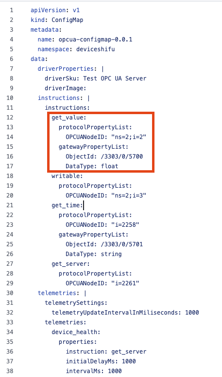

# Tutorial

## How to store data sent from HTTP devices in another LwM2M Object in the Gateway

### Folder used

https://github.com/Edgenesis/shifu-lwm2m-demo/tree/main/http/deviceshifu

### Steps

Update the instruction list in `configmap.yaml` for your device. In this example, we define a value instruction that maps to the device's HTTP `/value` API and forwards this API's data to the LwM2M `/3442/0/1110/1` object in string format.

If your device has another Object, please change the Object ID in `gatewayPropertyList`. The DataType should be string, int, float, or bool, with the default being string.


## How to decompose JSON data sent from an MQTT device and store it in a LwM2M Object in the Gateway

### Folder used

https://github.com/Edgenesis/shifu-lwm2m-demo/tree/main/mqtt-customized

### Steps

By default, `deviceShifuMQTT` will reply in the JSON format:

```json
{
  "mqtt_message": "raw_data",
  "mqtt_receive_timestamp": "0001-01-01 00:00:00 +0000 UTC"
}
```

To decompose JSON data from the message, we must use a customized deviceShifu with a Python script.

In this case, we define two customized functions to get `xAngle` and `yAngle` from the MQTT message.

**Note**: The Python script file name **must** be `customized_handlers.py`

```python
# customized_handlers.py
import json

# input
# {"xAngle":-73.08371735,"yAngle":-90}

# output
# -73.08371735
def XAngle(raw_data):
    return json.loads(raw_data["mqtt_message"])["xAngle"]

# output
# -90
def YAngle(raw_data):
    return json.loads(raw_data["mqtt_message"])["yAngle"]

def raw_value(raw_data):
    print(raw_data["mqtt_message"])
    return raw_data["mqtt_message"]
```

Then, build a customized deviceShifu image to load the Python script into deviceShifu with the command:

```bash
docker buildx build -f Dockerfile . -t edgenesis/lwm2m-demo-deviceshifu-http-mqtt-customized:nightly --load
```

Load the Docker image into your Kubernetes cluster:

If you are using kind:

```bash
kind load docker-image edgenesis/lwm2m-demo-deviceshifu-http-mqtt-customized:nightly
```

If you are using K3s:

```bash
docker save edgenesis/lwm2m-demo-deviceshifu-http-mqtt-customized:nightly | k3s ctr image import -
```

After that, change the address in `edgedevice.yaml` to your actual MQTT broker address.


Next, define the instructions. In this case, we define two instructions: `angle/x` and `angle/y`.

For the `angle/x` instruction:

- Forward the `/test/topic1` topic to the LwM2M gateway `/3442/0/1130/0`.

For the `angle/y` instruction:

- Forward the `/test/topic1` topic to the LwM2M gateway `/3442/0/1130/1`.

For the customized deviceShifu, bind the instruction to the target process function name, which is defined in the `customized_handlers.py` file.

In this case, we use the `XAngle` function to process the `angle/x` response data to decompose the JSON format and get the `xAngle` field. Similarly, we use the `YAngle` function to process the `angle/y` response data and extract the `yAngle` field.


## Connecting OPC UA to LwM2M

### Folder used

https://github.com/Edgenesis/shifu/tree/implement_lwm2m_deviceshifu/examples/opcua2lwm2mgateway

### Steps

To connect an OPC UA device, you need to change the address to your actual device address and update the `protocolSettings` in `edgedevice.yaml`. The protocolSettings can be referenced at [https://shifu.dev/docs/guides/cases/connect-opcua](https://shifu.dev/docs/guides/cases/connect-opcua)


Next, update `configmap.yaml` and bind the instruction to the OPC UA NodeId and the LwM2M gateway. In this case, we bind the OPC UA Node `ns=2;i=2` to the `get_value` instruction and map it to the LwM2M Object `/3303/0/5700`, which allows data retrieval by calling the instruction directly or through the LwM2M gateway.


